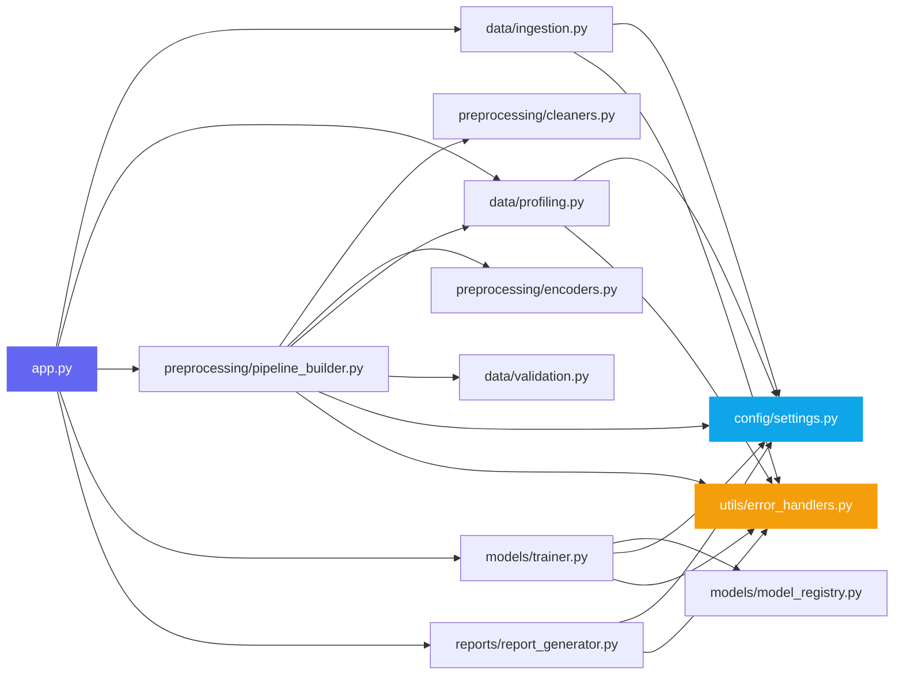

# 🤖 Production-Grade AutoML System for Classification & Regression

A comprehensive, clean-architecture Automated Machine Learning (AutoML) platform designed to automate end-to-end machine learning pipelines. Built with a modular Python backend and an interactive Streamlit frontend, this system handles messy, real-world datasets with extreme edge-case resilience and zero-config deployment.
---

## 🏗️ System Architecture

### Pipeline Flow

```mermaid
flowchart TD
    U(["👤 User"]):::user

    subgraph UI["🖥️ Streamlit Frontend  (app.py)"]
        direction TB
        T1["📤 Upload Tab"]
        T2["🔍 EDA & Issues Tab"]
        T3["⚙️ Preprocessing Tab"]
        T4["🎯 Training Tab"]
        T5["📈 Results Tab"]
        T6["💾 Export Tab"]
    end

    subgraph INGEST["📥 Data Layer  (automl/data/)"]
        direction TB
        DI["DataIngestor\n─────────────────\n• Encoding detection\n• Delimiter heuristics\n• Compression handling\n• BOM & header cleanup"]
        DP["DataProfiler\n─────────────────\n• Summary statistics\n• Missing value ratios\n• Outlier detection (IQR)\n• Class distribution"]
        DV["ColumnValidator\n─────────────────\n• Currency & unit stripping\n• Boolean inference\n• Mixed-type coercion"]
    end

    subgraph PREP["⚙️ Preprocessing Layer  (automl/preprocessing/)"]
        direction TB
        CL["Cleaners\n─────────────────\n• MissingValueHandler\n• OutlierHandler (IQR/Z)\n• ConstantFeatureRemover\n• HighCardinalityHandler\n• RareCategoryCollapser"]
        EN["Encoders\n─────────────────\n• CategoricalEncoder (OHE/Ordinal)\n• NumericScaler (Standard/MinMax)\n• FeatureEngineer (Polynomial)"]
        PB["PipelineBuilder\n─────────────────\n• sklearn.Pipeline orchestration\n• Leakage column removal\n• Duplicate row removal\n• fit_transform / transform"]
    end

    subgraph MODELS["🎯 Model Layer  (automl/models/)"]
        direction TB
        MR["ModelRegistry\n─────────────────\n• Logistic / Linear Regression\n• Decision Tree / Random Forest\n• KNN / Naive Bayes / SVM\n• GradBoost / AdaBoost\n• XGBoost / LightGBM"]
        MT["ModelTrainer\n─────────────────\n• RandomizedSearchCV tuning\n• StratifiedKFold CV\n• Timeout & resource guardrails\n• Best-model selection vs Dummy"]
    end

    subgraph REPORT["📊 Output Layer  (automl/reports/)"]
        RG["ReportGenerator\n─────────────────\n• HTML executive summary\n• EDA findings\n• Preprocessing steps log\n• Model comparison table\n• Next-steps & code snippet"]
    end

    subgraph CFG["🔧 Cross-Cutting  (automl/config/ & utils/)"]
        direction LR
        S["AutoMLConfig\n(settings.py)"]
        E["ErrorHandlers\n(error_handlers.py)"]
        L["Logger\n(logger.py)"]
    end

    U --> T1
    T1 -->|CSV upload| DI
    DI -->|clean DataFrame| DP
    DP -->|profile dict| DV
    DV -->|validated df| T2
    T2 -->|issues + approval| T3
    T3 -->|config choices| CL
    CL --> EN
    EN --> PB
    PB -->|X_processed, y| T4
    T4 --> MR
    MR -->|model configs + param grids| MT
    MT -->|all_results, best_model| T5
    T5 --> T6
    T6 --> RG
    RG -->|automl_report.html| U

    CFG -. "settings & error boundaries" .-> INGEST
    CFG -. "settings & error boundaries" .-> PREP
    CFG -. "settings & error boundaries" .-> MODELS

    classDef user fill:#6366f1,color:#fff,stroke:none,rx:8
    classDef layer fill:#1e293b,color:#94a3b8,stroke:#334155
    classDef mod fill:#0f172a,color:#e2e8f0,stroke:#1e293b,rx:6
```



### Module Dependency Map



---

## 🌟 Core Features & Engineering Highlights

### 1. 📥 Robust Data Ingestion
- **Automatic Encoding Detection**: Leverages `chardet` alongside multi-encoding attempts (`utf-8`, `latin-1`, etc.) to read files without Unicode errors.
- **Smart Delimiter Detection**: Samples file lines and uses statistical consistency (mean/std ratio) to automatically detect commas, semicolons, tabs, and pipes.
- **Compression & Format Support**: Seamlessly extracts and reads `.zip` and `.gzip` files, and automatically detects if an Excel or HTML file is incorrectly disguised with a `.csv` extension.
- **Pre-Clean Safeguards**: Detects and strips Byte Order Marks (BOM), removes duplicate/empty column names, and discards repeated headers.

### 2. 🔍 Automated Profiling & Data Quality Checks
- **Exploratory Data Analysis (EDA)**: Automatic calculation of dataset statistics, missing value ratios, and outlier ratios.
- **Visualizations**: Matplotlib & Seaborn-powered correlation matrix heatmaps, numerical distribution histograms, and categorical frequency bar charts.
- **Intelligent Issue Detection**: Identifies critical dataset concerns:
  - **Dataset Feasibility**: High-dimensionality warnings ($features > samples$) and small sample counts.
  - **Class Imbalance**: Flags skew in class distribution.
  - **Outliers & Cardinality**: Detects extreme values and flags high-cardinality columns.
- **User-in-the-Loop Fixes**: A dedicated Streamlit interface allowing users to review and approve suggested preprocessing fixes.

### 3. ⚙️ Preprocessing Pipeline
- **Dynamic Imputation**: Custom strategies for mean, median, mode, or constant imputation.
- **Currency & Unit Cleaning**: Automatically detects currency symbols and units of measurement (e.g., "kg", "ft", "$") in string columns, parses them, and cleans them into floating point values.
- **Categorical Encoders**: Smart One-Hot and Ordinal encoding with automatic rare category collapsing.
- **Feature Leakage Prevention**: Identifies and automatically drops identifier columns (e.g., `id`, `uuid`, `index`).
- **Feature Scaling**: Configurable Standard and Min-Max scaling.

### 4. 🎯 Model Registry & Trainer Suite
- **Comprehensive Algorithm Support**: Fits up to 9 classification and 11 regression algorithms:
  - Linear/Logistic Regression, Random Forests, Gradient Boosting (AdaBoost, XGBoost, LightGBM), K-Nearest Neighbors, SVMs, and Naive Bayes.
  - Baseline `Dummy` classifiers and regressors are used as control variables to measure exact value add.
- **Randomized Hyperparameter Tuning**: Automatically optimizes models via randomized grid search cross-validation.
- **Resource Guardrails**: Enforces time limits (`MAX_TRAINING_TIME_SECONDS`), limits training rows on large datasets, and manages parallel job counts to prevent memory overflows.

### 5. 📊 Evaluation Dashboard & Reporting
- **Metric Dashboards**: Shows sortable comparison tables of training time, accuracy, precision, recall, F1-score, RMSE, MAE, and $R^2$.
- **Interactive Visuals**: Confusion matrices, class distribution plots, and correlation matrices.
- **Automated Report Generation**: Generates standalone HTML executive summaries detailing the data quality profile, preprocessing steps, training configurations, and next steps for loading the model.

---

## 📁 Project Directory Structure

```
AutoML/
├── app.py                      # Interactive Streamlit Web Interface
├── requirements.txt            # Python Dependencies
├── README.md                   # System Documentation
│
├── automl/                     # Core Backend Framework
│   ├── config/
│   │   └── settings.py        # Centralized system settings and thresholds
│   ├── data/
│   │   ├── ingestion.py       # Robust file ingestion and format resolution
│   │   ├── profiling.py       # Statistical profiling and EDA
│   │   └── validation.py      # Column-level validation & unit/currency cleaner
│   ├── preprocessing/
│   │   ├── cleaners.py        # Missing value, outlier, and variance cleaners
│   │   ├── encoders.py        # Scalers, categorical encoders, and feature engineering
│   │   └── pipeline_builder.py# Scikit-learn Pipeline orchestrator
│   ├── models/
│   │   ├── trainer.py         # Cross-validation, tuning, and evaluation
│   │   └── model_registry.py  # Model configurations and parameter spaces
│   ├── reports/
│   │   └── report_generator.py# HTML report generator engine
│   └── utils/
│       ├── error_handlers.py  # Customized exceptions and error boundaries
│       └── logger.py          # Unified logger settings
│
└── sample_data/               # Pre-bundled datasets (Iris, Titanic, Wine)
```

---

## 🚀 Getting Started

### 1. Installation
Clone the repository:
```bash
git clone https://github.com/HaseebUllahButt/AutoML.git
cd AutoML
```

Create and activate a virtual environment:
```bash
python -m venv .venv
source .venv/bin/activate  # On Windows use: .venv\Scripts\activate
```

Install dependencies:
```bash
pip install -r requirements.txt
```

### 2. Run the Web Interface
Launch the Streamlit app:
```bash
streamlit run app.py
```
The interface will automatically load at `http://localhost:8501`.

---

## 👥 Contributors

- **Haseeb Ullah Butt**
- **Ali Mubashir**
---

## 📝 License

This project is created for educational purposes as part of CS-245 Machine Learning course.
